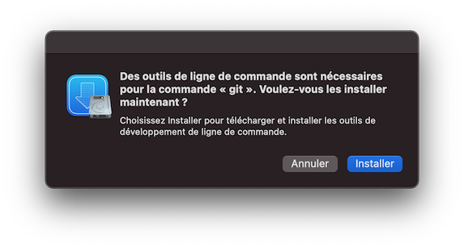

# It's a me! M.A.R.I.O.! 

MacOS
Ansible
Recipes:
Indepotent &
Omnipotent

It will pre-install a dev environment with all the big and small tools we use at [Web^ID](https://web-id.fr).

## What do I need to start?

A freshly installed (or not) macOS computer. Nothing else.

## Getting Started

First, you would need git, make sure it is installed by opening your terminal (cmd + space, then type "terminal" and hit enter) and typing `git --version`. If you see a popup that says you need command line tools to use git, click on the "Install" button.



After you clone this repository, you need to `make dotfiles`:

```bash
git clone https://github.com/web-id-fr/mario.git
cd mario
make dotfiles
```

This will copy the `config_vars.yml.dist` to `config_vars.yml` and the `mario-playbook.yml.dist` to `mario-playbook.yml`. You should edit those accordingly, see [Configuration](#configuration).

Then you just have to:

```
make install
```

### 🧙‍♀️ But what kind of magic is this?

Calling `make install` will:

* ✅ Install [homebrew](https://brew.sh/) if needed, *see [bin/install-brew.sh](bin/install-brew.sh)*
* ✅ Install [ansible](https://docs.ansible.com/) if needed, *see [bin/install-ansible.sh](bin/install-ansible.sh)*
* 🚀 Run the [mario-playbook.yml](mario-playbook.yml.dist) ansible playbook.

*Tip: if you only need to run the playbook, you can just `make mario`.*

## Configuration

## Old README bellow 👇

This is my Mac OS setup with Ansible

Edit `config_vars.yml` file accordingly.

```ssh
make install
```

Resetting this repository's origin to be able to push

```bash
git remote set-url origin git@github.com:tentacode/blacksmithery.git
```

## Bonus

On a fresh install, remove all the Dock items in one command :

```bash
defaults delete com.apple.dock persistent-apps; killall Dock
```

Hide all files in the desktop :

```bash
defaults write com.apple.finder CreateDesktop false; killall Finder
```

## Mac specific

### AppStore

* Code Runner
* Pixelmator

### direct download

* Logitech Options

### Todo

* Installer brew cask
* Node LTS
* ajouter wget
* ajouter valet / valet install
* Node LTS 14
* yarn
* vagrant
* auto set origin of repository to ssh
* mysql set password root : https://stackoverflow.com/questions/57803604/homebrew-mariadb-mysql-installation-root-access-denied
* dark menu / dock : defaults write -g NSRequiresAquaSystemAppearance -bool Yes (https://apple.stackexchange.com/questions/337478/how-to-get-dark-menu-bar-and-dock-in-mojave-light-mode)
* add rocket
* add gitmoji
* chrome

### Manual stuff

* Ctrl + Shift + 5 to open screenshot utility and change screenshot default folder.
